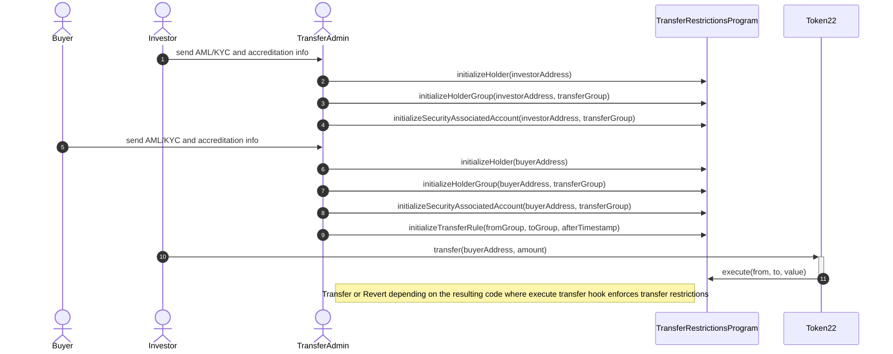
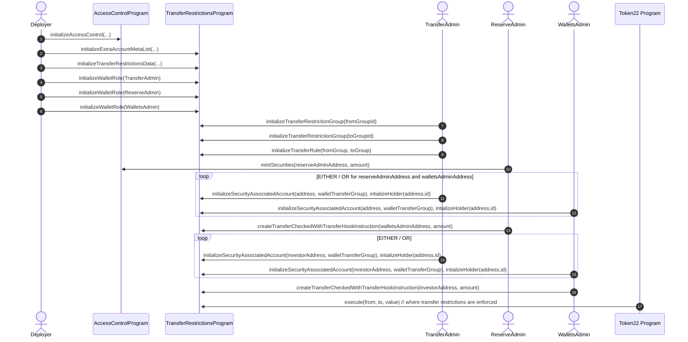
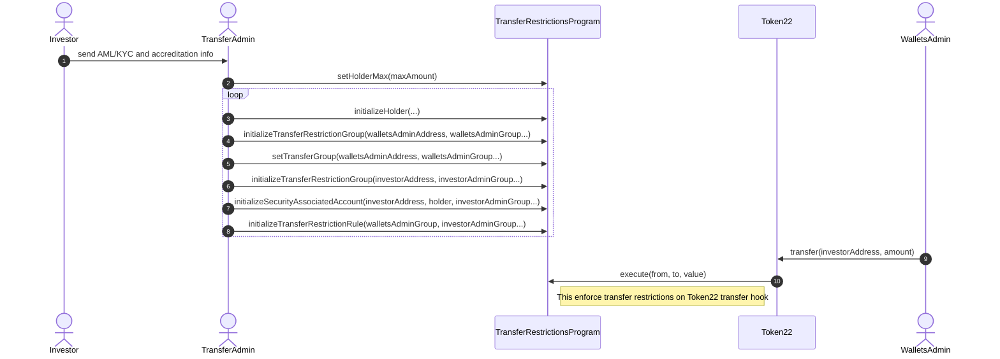
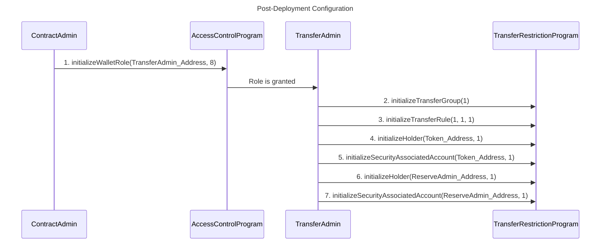

# Solana Security Token

# Environment Setup

The environment is necessary to build and run tests of the project.

1. Install Anchor 0.30.1 from https://www.anchor-lang.com/docs/installation

## Build and test source code

### Build programs
```
$ anchor build
```

### Test programs
1. Generate payer if it doesn't exist yet
```
$ solana-keygen new
```
2. Run the functional and integration tests. First it builds and deploys the smart contract then tests are executed locally.
```
$ anchor test
```

# Deployment

## Programs
Generate key and airdrop SOL to the generated address. Than specify cluster and path to the keypair.
```
$ solana-keygen new --outfile PATH_TO_GENERATED_KEYPAIR
``` 
Airdrop or get some SOL to deploy programs (~20 SOL)
```
$ solana airdrop 20 PUBKEY --url CLUSTER_MONIKER_OR_RPC_URL
```
```
$ anchor deploy --provider.cluster CLUSTER --provider.wallet PATH_TO_KEYPAIR
```

## Mint and Progrmas Accounts
Generate or add data deployment keypair into `deploy/CLUSTER/deployer.json` file as buffer (for example: `[10, 20 .. 12]`).

Configure `config.ts` where specify
mint parameters: 
 - `decimals`
 - `name`
 - `symbol`
 - `uri` (logo)
tokenlock parameters:
 - `maxReleaseDelay`
 - `minTimelockAmount`
 - `space` (in bytes, it is recommended to set 1 Mb)
other parameters:
 - `maxHolders`
 - `maxTotalSupply`
 - `commitment`
 - `admins` (array of public keys and their role)

Configure RPC URL inside `.env` (copy `.env.example`) if it is different from default.
```
$ yarn deploy:CLUSTER
```

## Deployment Result
Deployment script generates mint.json with keypair and tokenlock-data-pubkey.json with public key.
Print information about deployment into console.

# Overview
This is a Security Token smart contract implementation from Upside. 
The core purpose of the token is to enforce transfer restrictions for certain groups.


This implementation attempts to balance simplicity and sufficiency for smart contract security tokens that need to comply with regulatory authorities - without adding unnecessary complexity for simple use cases.

Solana Security Token consists of several modules:
* **Access Management**
* **Transfer Groups and Rules Management**
* **Token2022 Security Token Tansfer**

### Disclaimer

This open or closed source software is provided with no warranty. This is not legal advice. CoMakery (dba Upside) is not a legal firm and is not your lawyer. Securities are highly regulated across multiple jurisdictions. Issuing a security token incorrectly can result in financial penalties or jail time if done incorrectly. Consult a lawyer and tax advisor. Conduct an independent security audit of the code.

## On-Chain Holder/Wallet Management

Active Holder/Wallet management is conducted on-chain and autonomously, with multiple admin configurations that allow flexibility of transfer rule configuration. This greatly simplifies the off-chain accounting and effort required from Transfer (and other) Admins, removing the need to track Wallet holdings across different Holders.

Wallets are not programatically prohibited from assuming multiple Admin roles. We advise against this in practice; however, this must be enforced off-chain. 

Holders are allowed to keep multiple Wallet addresses, which can be spread across multiple Transfer Groups (in which case, they would be added to each group's holder count) as well as _within_ Transfer Groups. These Wallets are consolidated under a common `holderId`.

- Ex.: Holder A can have 4 wallets spread across two Transfer Groups, X and Y. The Holder can have Wallets 1 & 2 in Group X, and Wallets 3 & 4 in Group Y. They will still count overall as one single Holder, but it will also be considered as a unique holder in Group X and one unique holder in Group Y.

To manage these Holders and their Wallets:

- A initialized Holder account is enforced on SecurityAssociatedAccount creation for wallet, automatically checking that recipient Wallet addresses of tokens are cataloged and assigned `holderId`s as needed.
- If a "new" Wallet address receives a token, a new `holderId` is created for that Wallet address.
- Admins can also separately create Holders from Wallet addresses and append Wallet addresses to existing Holder accounts

## Transfer Restrictions

The Security Token can be configured after deployment to enforce transfer restrictions such as the ones shown in the diagram below. Each Holder's blockchain Wallet address corresponds to a different group.

This is enforced by TransferRestrictions Program and Transfer Hook.

### Example

Only transfers between wallet address groups in the direction of the arrows are allowed:


Here's an example overview of how transfer restrictions could be configured and enforced.



The Transfer Admin for the TransferRestrictionsProgram can provision wallet addresses to transfer and receive tokens under certain defined conditions. This is the process for configuring transfer restrictions and executing token transfers:

1. An Investor sends their Anti Money Laundering and Know Your Customer (AML/KYC) information to the Transfer Admin or to a proxy vetting service off-chain to verify this information. 
    - The benefit of using a qualified third party provider is to avoid needing to store privately identifiable information.
    - We recommend implementations use off-chain mechanisms (such as a 3rd party AML/KYC provider) that ensure a given address is approved and is a non-malicious smart contract wallet. However, generally multi-signature type wallets must be allowed in order to provide adequate security for investors.
    - This smart contract implementation does not provide a solution for collecting AML/KYC information.

2. The Transfer Admin or Wallet Admin calls `initialalizeHolder(buyerAddress)`, `initializeHolderGroup(buyerAddress, transferGroup)` and `initializeSecurityAssociatedAccount(buyerAddress, transferGroup)` to provision their account. Initially this will be done for the Primary Issuance of tokens to Investors where tokens are distributed directly from the Issuer to Holder wallets, where:

   - `buyerAddress`: Buyer/Investor wallet address for which to set permissions
   - `transferGroup`: desired transfer group ID for wallet address

3. A potential Investor sends their AML/KYC information to the Transfer Admin or Wallet Admin or a **trusted** AML/KYC provider.

4. The Transfer Admin or Wallet Admin calls `initialalizeHolder(investorAddress)`, `initializeHolderGroup(investorAddress, transferGroup)` and `initializeSecurityAssociatedAccount(investorAddress, transferGroup)` to provision the Investor account.

5. At this time (or potentially earlier), the Transfer Admin or Wallet Admin authorizes the transfer of tokens between account groups with `initializeTransferRule(fromGroup, toGroup, afterTimestamp)`. Note that allowing a transfer from group A to group B by default does not allow the reverse transfer from group B to group A. This would need to be configured separately.

   - Ex.: Reg CF unaccredited Investors may be allowed to sell to Accredited US Investors but not vice versa.

Relevant methods:
```typescript
/**
  * @dev Initialize new transfer group
  * @param groupId Unique id of the group
  * @accounts
  * @param transferRestrictionGroup The transfer restriction group PDA as ["trg", transferRestrictionData, groupId].
  * @param transferRestrictionData The Transfer Restricition data initialized for securityToken
  * @param accessControlAccount Access Control Account.
  * @param payer Wallet which pays transaction fee. Must be Transfer Admin
  * @param systemProgram Solana System Program which is required for new on-chain account data initialization
  */
.initializeTransferRestrictionGroup(groupId)
  .accountsStrict({
    transferRestrictionGroup,
    transferRestrictionData,
    accessControlAccount,
    payer,
    systemProgram,
  })
```

```typescript
/**
  * @dev Sets an allowed transfer from a group to another group beginning at a specific time.
  * There is only one definitive rule per from and to group.
  * @param lockedUntil The unix timestamp that the transfer is locked until. 0 is a special number. 0 means the transfer is not allowed.
  * This is because in the smart contract mapping all pairs are implicitly defined with a default lockedUntil value of 0.
  * But no transfers should be authorized until explicitly allowed. Thus 0 must mean no transfer is allowed.
  * @accounts
  * @param transferRule The transfer rule PDA as ["tr", transferRestrictionGroupFrom, transferRestrictionGroupTo].
  * @param transferRestrictionGroupFrom The group the transfer is coming from.
  * @param transferRestrictionGroupTo The group the transfer is going to.
  * @param accessControlAccount Access Control Account.
  * @param payer Wallet which pays transaction fee. Must be Transfer Admin
  * @param systemProgram Solana System Program which is required for new on-chain account data initialization
  */
initializeTransferRule(lockedUntil)
  .accountsStrict({
    transferRule,
    transferRestrictionData,
    transferRestrictionGroupFrom,
    transferRestrictionGroupTo,
    accessControlAccount,
    payer,
    systemProgram,
  })
```

```typescript
/**
  * @dev A convenience method for initializing the new holder.
  * @param recipientHolderId The created holderId 
  * @accounts
  * @param transferRestrictionHolder The transfer restriction holder PDA as ["trh", transferRestrictionData, holderId].
  * @param transferRestrictionData The Transfer Restricition data initialized for securityToken
  * @param payer Wallet which pays transaction fee. Must be Transfer or Wallets Admin
  * @param systemProgram Solana System Program which is required for new on-chain account data initialization
  */
.initializeTransferRestrictionHolder(holderId)
  .accountsStrict({
    transferRestrictionHolder,
    transferRestrictionData,
    accessControlAccount,
    payer,
    systemProgram,
  })
```

```typescript
/**
  * @dev A convenience method for initializing the new holder.
  * @accounts
  * @param holderGroup The transfer restriction holderGroup PDA as ["trhg", transferRestrictionData, holderId].
  * @param transferRestrictionData The Transfer Restricition data initialized for securityToken
  * @param holder The transfer restriction holder PDA as ["trh", transferRestrictionData, holderId].
  * @param payer Wallet which pays transaction fee. Must be Transfer or Wallets Admin
  * @param systemProgram Solana System Program which is required for new on-chain account data initialization
  */
.initializeHolderGroup()
  .accountsStrict({
    holderGroup,
    transferRestrictionData,
    group,
    holder,
    authorityWalletRole,
    payer,
    systemProgram,
  })
```

```typescript
/**
  * @dev A convenience method for initializing the transfer group, lock until.
  * @accounts
  * @param securityAssociatedAccount The security associated account PDA as ["saa", associatedTokenAccount].
  * @param group The desired group account PDA linked with groupId to set for the address.
  * @param holder The holder account PDA linked with holderId
  * @param securityToken The Token 22 address
  * @param transferRestrictionData The Transfer Restricition data initialized for securityToken
  * @param payer Wallet which pays transaction fee. Must be Transfer or Wallets Admin
  * @param systemProgram Solana System Program which is required for new on-chain account data initialization
  */
initializeSecurityAssociatedAccount()
  .accountsStrict({
    securityAssociatedAccount,
    group,
    holder,
    securityToken,
    transferRestrictionData,
    userWallet,
    associatedTokenAccount,
    payer,
    systemProgram,
  })
```

## WARNING: Maximum Total Supply, Minting and Burning of Tokens

The variable `maxTotalSupply` is set when the contract is created and limits the total number of tokens that can be minted.

**Reserve Admins can mint tokens to and burn tokens from any address. This is primarily to comply with law enforcement, regulations and stock issuance scenarios - but this centralized power could be abused. Transfer Admins, authorized by Contract Admins, can also update the transfer rules at any moment in time as many times as they want.**

## Overview of Transfer Restriction Enforcement Functions

| From                                 | To                                                        | Restrict                                                                                          | Enforced By                                                                                                  | Admin Role                                                                                |
| :----------------------------------- | :-------------------------------------------------------- | :------------------------------------------------------------------------------------------------ | :----------------------------------------------------------------------------------------------------------- | :---------------------------------------------------------------------------------------- |
| Reg D/S/CF                           | Anyone                                                    | Until TimeLock ends                                                                               | `mintReleaseSchedule(investorAddress, balanceReserved, commencementTime, scheduleId, cancelableByAddresses)` | Reserve Admin                                                                                 |
| Reg S Group                          | US Accredited                                             | Forbidden During Flowback Restriction Period                                                      | `initializeTransferRule(fromGroupS, toGroupD, afterTime)`                                                     | Transfer Admin                                                                            |
| Reg S Group                          | Reg S Group                                               | Forbidden Until Shorter Reg S TimeLock Ended                                                      | `initializeTransferRule(fromGroupS, toGroupS, afterTime)`                                                     | Transfer Admin                                                                            |
| Issuer                               | Reg CF with > maximum number of total holders allowed     | Forbid transfers increasing number of total Holders (across all groups) above a certain threshold | `setHolderMax(maxAmount)`                                                                                    | Transfer Admin                                                                            |
| Issuer                               | Reg CF with > maximum number of Holders per group allowed | Forbid transfers increasing number of total Holders (within each group) above a certain threshold | `setHolderGroupMax(transferGroupID, maxAmount)`                                                              | Transfer Admin                                                                            |
| Stolen Tokens                        | Anyone                                                    | Fix With Freeze, Burn, Reissue                                                                    | `freeze(address, isFrozenFlag);`<br /> `burnSecurities(address, amount);`<br />`mintSecurities(newOwnerAddress);`                | Wallets Admin or Transfer Admin can `freeze()` and Reserve Admin can do `mintSecurities()` `burnSecurities()` |
| Any Address During Regulatory Freeze | Anyone                                                    | Forbid all transfers while paused                                                                 | `pause(isPausedFlag)`                                                                                        | Transfer Admin                                                                            |
| Any Address During Regulatory Freeze | Anyone                                                    | Unpause from a paused state                                                             | `pause(isPausedFlag)`                                                                                        | Transfer Admin                                                                            |
| Anyone                               | Anyone                                                    | Force the transfer of tokens for emergencies                                                      | `forceTransferBetween(sender, recipient, amount)`                                                            | Reserve Admin                                                                              |

# Roles

The smart contract enforces specific admin roles. The roles divide responsibilities to reduce abuse vectors and create checks and balances. Ideally each role should be managed by a separate admin with separate key control. 

In some cases, such as for the Contract Admin or Wallets Admin, it is recommended that the role's private key is managed through multi-signature (e.g. requiring 2 of 3 or N of M approvers) authentication.

### Admin Types

The Admin functionality breaks down into 4 main roles. The contract is configured to expect these wallets. In the contract constructor:

- **Contract Admin**
  - Akin to root level access administrator. Can upgrade internal contract dependencies (ie `RestrictedSwap`, `TransferRules`) or grant Admin permissions. Recommended to be a secure multi-sig wallet.
- **Reserve Admin**
  - Receives initial tranche of minted tokens from deployment. Also can adjust the supply of tokens by minting or burning or forcibly initiate transfers.

Via granted roles (from **Contract Admin**):

- **Transfer Admin**
  - Can set transfer restriction permissions/rules between groups or invoke snapshots.
  - **Transfer Admin** capabilities are a superset of those of **Wallets Admin**.
- **Wallets Admin**
  - Can manage Holder/Wallet transfer group assignments.

Typically any legal entity third-party Transfer Agent will need access to both the roles for **Transfer Admin** and **Wallets Admin**. However some agents (such as exchanges) will, for example, be able to assign groups to wallets and permission them (as a **Wallets Admin**) but will not be able to adjust the transfer rules.

## Admin Functionality

| Function                   | Contract Admin | Reserve Admin | Transfer Admin | Wallets Admin |
| -------------------------- | -------------- | ------------- | -------------- | ------------- |
| upgradeTransferRules()     | **yes**        | no            | no             | no            |
| snapshot()                 | **yes**        | no            | no             | no            |
| mint()                     | no             | **yes**       | no             | no            |
| burn()                     | no             | **yes**       | no             | no            |
| forceTransferBetween()     | no             | **yes**       | no             | no            |
| pause() or unpause (ie pause(false)) | no   | no            |  **yes**       | no            |           
| setAllowGroupTransfer()    | no             | no            | **yes**        | no            |
| setHolderMax()             | no             | no            | **yes**        | no            |
| setHolderGroupMax()        | no             | no            | **yes**        | no            |
| fundDividend()             | no             | no            | **yes**        | no            |
| initilizeTransferRule()    | no             | no            | **yes**        | **yes**       |
| freeze()                   | no             | no            | **yes**        | **yes**       |
| setTransferGroup()         | no             | no            | **yes**        | **yes**       |
| createHolderFromAddress()  | no             | no            | **yes**        | **yes**       |
| appendHolderAddress()      | no             | no            | **yes**        | **yes**       |
| addHolderWithAddresses()   | no             | no            | **yes**        | **yes**       |
| removeHolder()             | no             | no            | **yes**        | **yes**       |
| createReleaseSchedule()    | **yes**        | **yes**       | **yes**        | **yes**       |
| mintReleaseSchedule()      | no             | **yes**       | no             | no            |

Note! Anyone can burn owned tokens by Solana SPL design

# Use Cases

## Initial Security Token Deployment


1. AccessControl and TransferRestrictions programs are deployed first  
2. Deployer initializes access control data, mint, transfer restrictions data. At the time of deployment, the deployer configures a separate Reserve Admin address, a Transfer Admin address, and a Wallets Admin address. This allows the reserve security tokens to be stored in cold storage since the treasury Reserve Admin address private keys are not needed for everyday use by the Transfer Admin.
2. The Reserve Admin then provisions a Wallets Admin address for distributing tokens to investors or other stakeholders. The Wallets Admin uses `initializeSecurityAssociatedAccount(investorAddress, transferGroup)` to set address restrictions.
3. The Transfer Admin authorizes the transfer of tokens between account groups with `initializeTransferRestrictionGroup(fromGroup, toGroup, afterTimestamp)` .
4. The Reserve Admin then transfers tokens to the Wallets Admin address.
5. The Wallets Admin then transfers tokens to Investors or other stakeholders who are entitled to tokens.

# Setup For Separate Issuer Private Key Management Roles

By default the reserve tokens cannot be transferred to. To allow transfers the Transfer Admin or Wallets Admin must configure transfer rules using both `updateTransferRestrictionGroup(transferGroup)` to configure the individual account rules and `initialzeTransferRule/updateTransferRule(account, groupFrom, groupTo)` to configure transfers between accounts in a group. A group represents a category like US accredited investors (Reg D) or foreign investors (Reg S).

During the setup process to split transfer oversight across three private key holders, the Transfer Admin can setup rules that only allow the Reserve Admin group to **only** transfer tokens to the Wallets Admin address group. The Wallets Admin should be restricted to a limited maximum balance necessary for doing one batch of token distributions - rather than the whole reserve. The use of a hot wallet Wallets Admin for small balances also makes everyday token administration easier without exposing the issuer's reserve of tokens to the risk of total theft in a single transaction. Each of these private keys may also be managed with a multi-sig solution for added security.

Multi-sig is especially important for the token Reserve Admin and Contract Admin.

Here is how these restricted Admin accounts can be configured:

1. Transfer Admin, Reserve Admin and Wallets Admin accounts are managed by separate users with separate keys. For example, separate Nano Ledger X hardware wallets.
2. Reserve and Wallets Admin addresses can have their own separate transfer groups.
   - `updateWalletGroup(reserveAdminAddress, reserveAdminTransferGroup)`
   - `updateWalletGroup(walletsAdminAddress, walletsAdminTransferGroup)`
3. Reserve Address Group can only transfer to Wallets Admin Groups after a certain Timestamp.
   - `initializeTransferRule(reserveAdminTransferGroup, walletsAdminTransferGroup, afterTimestamp)`
4. Wallets Admin Address can transfer to investor groups like Reg D and Reg S after a certain Timestamp.
   - `initializeTransferRule(walletsAdminTransferGroup, regD_TransferGroup, afterTimestamp)`
   - `initializeTransferRule(walletsAdminTransferGroup, regS_TransferGroup, afterTimestamp)`

Then the Wallets Admin can distribute tokens to investors and stakeholders as described below...

## Issuing the Token To AML / KYC'd Recipients



1. The Transfer Admin gathers AML/KYC and accreditation information from investors and stakeholders who will receive tokens directly from the Issuer (the Primary Issuance).
1. (optional) set the Holder max if desired
1. Transfer Admin configures approved Transfer Group for Wallets Admin.
1. Transfer Admin then configures approved Transfer Groups for Investor and stakeholders with `initializeSecurityAssociatedAccount(address, holder, transferGroup)`. Based on the AML/KYC and accreditation process the investor can provision the account address with:

   a) a transfer group designating a regulatory class like "Reg D", "Reg CF" or "Reg S"

   b) the freeze status of that address (with true meaning the account will be frozen from activity)] `freezeWallet(address)`

1. The Transfer Admin then must allow transfers between groups with `initializeTransferRestrictionRule(walletsAdminGroup, investorAdminGroup...)`

1. The tokens can then be transferred from the Issuer's wallet to the provisioned addresses.

1. Transfer Restrictions are detected.

Note that there are no transfers initially authorized between groups. By default no transfers are allowed between groups - all transfer groups are restricted.

## Maximum Number of Holders Allowed (TODO: to be developed)

By default Transfer Groups cannot receive token transfers. To receive tokens the issuer gathers AML/KYC information and then calls `initializeSecurityAssociatedAccount()`.

A single Holder may have unlimited Wallet addresses. This cannot be altered. The Issuer can only configure the maximum number of **Holders** allowed (via Transfer Admin) by calling `setHolderMax`. By default, this limit is set to `2**64-1`.

`setHolderMax(amount)`

## Maximum Number of Holders Allowed Per Group (TODO: to be developed)

Transfer Admin can configure the maximum number of allowed Holders **per group** by calling `setHolderGroupMax`. By default, the `holderGroupMax` for each group is set to 0, meaning that it won't be applied as a restriction.

Group 0 (the default Holder group) is the only group for which the holder group max variable cannot be applied (an unlimited number of Group 0 Holders are allowed in perpetuity).

`setHolderGroupMax(groupID, amount)`

## `initializeTransferRestrictionGroup`

`initializeTransferRestrictionGroup` is used to create new transfer group like US accredited investors (Reg D) or foreign investors (Reg S).

## `initializeSecurityAssociatedAccount`

`initializeSecurityAssociatedAccount` is usually used after KYC/AML verification to activate a particular wallet for transfers.

## `initialializeTransferRule`

`initilizeTransferRule` is used to create new transfer rule for 2 specified groups where `..groupFrom` for senders and `..groupTo` for reveivers

## Example Transfer Restrictions

### Example: Investors Can Trade With Other Investors In The Same Group (e.g. Reg S)

To allow trading in a group:

- Call `updateWalletGroup(address, transferGroup)` for trader Wallets in the group
- `initializeTransferRule(fromGroupX, toGroupX, groupTimeLock)` for Wallets associated with groupIDs (for example, Reg S)
- A token transfer for an allowed group will succeed if:
  - the recipient of a token transfer does not result in a total holder count in a given group that exceeds the defined `holderGroupMax` (if configured, ie `holderGroupMax` set to > 0)
  - the recipient of a token transfer does not result in a total global holder count that exceeds the defined `holderMax`

### Example: Avoiding Flowback of Reg S "Foreign" Assets

To allow trading between Foreign Reg S account addresses but forbid flow back to US Reg D account addresses until the end of the Reg D lockup period

- Call `updateWalletGroup(address, groupIDForRegS)` to configure settings for Reg S investors
- Call `updateWalletGroup(address, groupIDForRegD)` to configure settings for Reg D investors
- `initializeTransferRule(groupIDForRegS, groupIDForRegS, addressTimelock)` allow Reg S trading
- A token transfer for between allowed groups will succeed if:
  - the `addressTimelock` time has passed; and
  - the recipient of a token transfer is not frozen (ie `freezeStatus` is `false`).

### Example: Exchanges Can Register Omnibus Accounts

Centralized exchanges can register custody addresses using the same method as other users. They contact the Issuer to provision accounts and the Transfer Admin or Wallets Admin calls `initializeSecurityAssociatedAccount()` for the exchange account.

When customers of the exchange want to withdraw tokens from the exchange account they must withdraw into an account that the Transfer Admin has provisioned for them with `initializeSecurityAssociatedAccount()`.

Talk to a lawyer about when exchange accounts may or may not exceed the maximum number of holders allowed for a token.

## Group 0 Transfer Restrictions

In general, it is possible to allow Group 0 transfers. They are configurable in the same way that other transfer restrictions across different groups can be configured. This allowance is required for certain real-world situations. For example, if all tokens are freely tradeable under Reg A+ or a public filing, then Group 0 transfers can be allowed.

## Transfers Can Be Paused To Comply With Regulatory Action

If there is a regulatory issue with the token, all transfers may be paused by the Transfer Admin calling `pause()`. During normal functioning of the contract `pause()` should never need to be called.

*Note*: This `pause()` mechanism has been implemented into the `TransferRestrictions` program but **not** the `Dividends` contract. As pauses are intended for emergency situations; and dividends, once funded, belong fully to the recipient (even if locked), the pause mechanism has been excluded so as to prevent potential pause abuse from circumventing rightful dividends distributions. 

## Law Enforcement Recovery of Stolen Assets

In the case of stolen assets with sufficient legal reason to be returned to their owner, the issuer can call `freeze()` (Wallets Admin, Transfer Admin), `burnSecurities()`, and `mintSecurities()` (Reserve Admin) to transfer the assets to the appropriate account.

Although this is not in the spirit of a cryptocurrency, it is available as a response to requirements that some regulators impose on blockchain security token projects.

## Asset Recovery In The Case of Lost Keys

In the case of lost keys with sufficient legal reason to be returned to their owner, the issuer can call `freeze()`, `burnSecurities()`, and `mintSecurities()` to transfer the assets to the appropriate account. This opens the issuer up to potential cases of fraud. Handle with care.

Once again, although this is not in the spirit of a cryptocurrency, it is available as a response to requirements that some regulators impose on blockchain security token projects.

# Access Control

Access Control Program implements roles `initializeWalletRole`, `updateWalletRole` and ownership under admin security token functions: `mintSecurities`, `burnSecurities`, `freeze`, `forceTransferbetween`. This is similar to the linux file permission bitmask exposed in the `chmod` command line function.

Our implementation uses binary bitmask determine the access control roles for an address. This optimizes the compute units usage and the size of the smart contract code itself.

## How it works

We use a `u8` binary representation of a number, such as `01010101` to represent the roles IDs within the access controls.

Roles are defined by a specific bit position in the bit storage representation.

As example decimal 1 is `00000001` in binary mode, 2 is `00000010`, 3 is `00000011`, 4 is `00000100`, 7 is `00000111` etc.

We describe the roles in use as:

```rust
#[repr(u8)]
pub enum Roles {
    ContractAdmin = 1,  // 0001
    ReserveAdmin = 2,   // 0010
    WalletAdmin = 4,    // 0100
    TransferAdmin = 8,  // 1000
    All = 15,           // 1000
}
```

If you want to use the unused bits in the future to add new roles you can add something like

```rust
NewRole = 16;     // 000010000
SecondRole = 32;  // 000100000
All = 63;         // 000111111
...etc
```

You can grant multiple roles by adding the role number values together to get the correct bitmask representation like this:

```rust
WalletAndTransferAdmin = 12; // 0001100
```

or
```rust
const WALLET_AND_TRANSFER_ADMIN_ROLE: u8 = Roles::WalletsAdmin as u8 | Roles::TransferAdmin as u8; // 0001100
```

For manipulating binary numbers you can use binary operators \*&, | and ^.

Example:

```rust
const WALLET_AND_TRANSFER_ADMIN_ROLE: u8 = Roles::WalletsAdmin as u8 | Roles::TransferAdmin as u8;

some_number & WALLETS_ADMIN_ROLE > 0 // checking if some_number contains 0100 bit, it can be used for checking the role
```

The contract implements simple methods to manipulate Access Controls and check the roles. Note that granting new and revoking existing roles must be done in separate transactions. 

```rust
 fn initialize_wallet_role(u8 role)

 fn updateWalletRole(u8 role)
```

# Appendix

## Roles Matrix

Admin permissions are defined with the following binary values. Roles are defined as the `OR` of a set of admin roles:

Contract Admin: `0001`
Reserve Admin: `0010`
Wallets Admin: `0100`
Transfer Admin: `1000`

| Role Integer | Admin Roles                                     | Bit Mask Representation |
| ------------ | ----------------------------------------------- | ----------------------- |
| 0            | None (Default)                                  | `0000`                    |
| 1            | Contract Admin                                  | `0001`                    |
| 2            | Reserve Admin                                   | `0010`                    |
| 3            | Contract Admin + Reserve Admin                  | `0011`                    |
| 4            | Wallets Admin                                   | `0100`                    |
| 5            | Contract Admin + Wallets Admin                  | `0101`                    |
| 6            | Reserve Admin + Wallets Admin                   | `0110`                    |
| 7            | Contract Admin + Reserve Admin + Wallets Admin  | `0111`                    |
| 8            | Transfer Admin                                  | `1000`                    |
| 9            | Contract Admin + Transfer Admin                 | `1001`                    |
| 10           | Reserve Admin + Transfer Admin                  | `1010`                    |
| 11           | Contract Admin + Reserve Admin + Transfer Admin | `1011`                    |
| 12           | Wallets Admin + Transfer Admin                  | `1100`                    |
| 13           | Contract Admin + Wallets Admin + Transfer Admin | `1101`                    |
| 14           | Reserve Admin + Wallets Admin + Transfer Admin  | `1110`                    |
| 15           | All Roles (Contract, Reserve, Wallets, Transfer)| `1111`                    |

## Post-Deployment Configuration

After smart contract deployment, there are certain configurations to complete before token issuance and trading can occur smoothly.

1. Grant Transfer Admin Role

    Although Transfer Admin is a required deployment parameter for the Dividends contract, it still must be specifically set in the Token contract separately, by the Contract Admin. 
    
    This is important so that an admin exists which can configure group transfers. 

1. Allow Group Transfers

    The Transfer Admin can then allow group transfers, for example between all traders within Group 1. This will allow transfers to occur between all traders placed in Group 1.

    This is important so that transfers of tokens are enabled between designated groups.

1. Whitelist Program Derived Address (PDA)

    The Transfer Admin can then set the group of the PDA address itself. 

    It is important that group transfers are allowed between PDA and recipients. This is necessary to take into account during integration Security Token with your Program. 



## Troubleshooting

To enable transfers between wallets, ensure that:

- both sender and recipient are placed into desired transfer groups (ie invoking `initializeSecurityAssociatedAccount` or `updateWalletGroup`)
- these transfer groups have approved transfer restrictions (ie invoking `initializeTransferRule`)
- sender has available tokens to be transferred

Note that `balance` property of AssociatedTokenAccount typically used by wallet providers (ie Phantom) will display wallet balance that includes the amount of simple tokens. Any locked, staked tokens are held by related Smart Contracts. 
